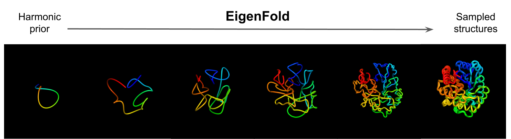

# EigenFold

Implementation of **EigenFold: Generative Protein Structure Prediction with Diffusion Models** by Bowen Jing, Ezra Erives, Peter Pao-Huang, Gabriele Corso, Bonnie Berger, Tommi Jaakkola.

EigenFold is a diffusion generative model for protein structure prediction (i.e., known sequence -> distribution of structures). It is based on *harmonic diffusion*, which incorporates bond constraints in the diffusion modeling framework and results in a cascading-resolution generative process. This repository focuses on the experimental setting described in the paper---using OmegaFold embeddings to produce an ensemble of predicted backbone structures---but should be extensible to other settings.

Please contact bjing@mit.edu with any comments or issues.



## Installation
```
pip install torch==1.11.0+cu113 -f https://download.pytorch.org/whl/torch_stable.html
pip install torch-scatter torch-sparse torch-cluster torch-spline-conv torch-geometric -f https://data.pyg.org/whl/torch-1.11.0+cu113.html
pip install e3nn pyyaml wandb biopython matplotlib pandas
```
We use `python=3.10.9`, but any reasonably recent version should be fine.

Download the OmegaFold weights and install the modified OmegaFold repository.
```
wget https://helixon.s3.amazonaws.com/release1.pt
git clone https://github.com/bjing2016/OmegaFold
pip install --no-deps -e OmegaFold
```
Finally install the [LDDT](https://openstructure.org/lddt/) and [TMScore](https://zhanggroup.org/TM-score/) binaries and add them to your `PATH`.

## Paper results
All results are obtained from sampled structures in `./pretrained_model` and reference structures in `./structures`. The numbers can be reproduced by running `single_structure_analysis.ipynb` and `ensemble_analysis.ipynb`. To reproduce the sampled structures themselves, first generate OmegaFold embeddings
```
python make_embeddings.py --out_dir ./embeddings --splits [SPLIT_CSV] 
```
where `[SPLIT_CSV]` is one of the provided `splits/{cameo_2022.csv, codnas.csv, apo.csv}`. This step will take 30 mins to 1 hour per split. Then run
```
python inference.py --model_dir ./pretrained_model --ckpt epoch_7.pt --pdb_dir ./structures --embeddings_dir ./embeddings --embeddings_key name --elbo --num_samples 5 --alpha 1 --beta 3 --elbo_step 0.2 --splits [SPLIT_CSV] 
```
Note that this will overwrite the provided sampled structures.

## Running inference

To run inference on new sequences, prepare a CSV file with columns `name`, `seqres` (see provided splits for examples) and run
```
python make_embeddings.py --out_dir ./embeddings --splits [NEW_CSV]
```
to generate OmegaFold embeddings. Finally run
```
python inference.py --model_dir ./pretrained_model --ckpt epoch_7.pt --embeddings_dir ./embeddings --embeddings_key name --elbo --num_samples 5 --alpha 1 --beta 3 --elbo_step 0.2 --splits [NEW_CSV] 
```
A directory with samples and trajectories and a CSV file with ELBOs and validation metrics will be created in `--model_dir`. If the reference structures are not found in the `--pdb_dir`, validation metrics will be `nan`. The inference speed will vary based on the settings, but the provided command will take a few hours to run.

## Retraining the model

To retrain the model, first download structures from the PDB (will take several hours depending on internet speed)
```
bash download_pdb.sh ./data
```
Prepare the chains dataframe and splits (approx 50 worker-hours)
```
python unpack_pdb.py --num_workers [N]
python make_splits.py
```
This will also reproduce (and overwrite) `splits/{cameo2021.csv, codnas.csv, apo.csv}`.

Run OmegaFold to make the embeddings, which can be parallelized across GPUs follows
```
for i in {0..7}; do
    CUDA_VISIBLE_DEVICES=$i python make_embeddings.py --splits splits/limit256.csv --reference_only --num_workers 8 --worker_id $i &
done
```
With 8 GPUs, it should take about 12hrs to generate embeddings for 63k unique sequences in `limit256.csv`.

Finally launch training (default settings as used in the paper)
```
python train.py --splits splits/limit256.csv
```
The model checkpoints will be saved under `workdir/[UNIX_TIME]`, timestamped according to the launch time. The training speed is approximate 12hrs / epoch.